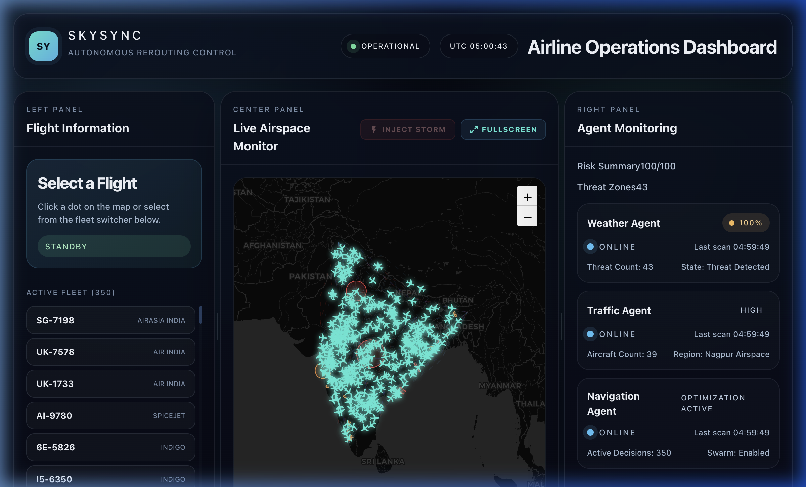
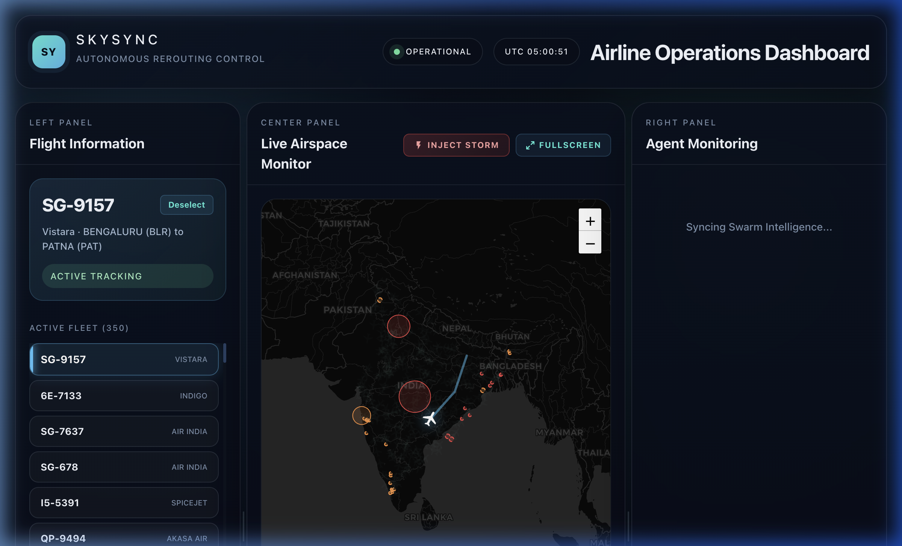
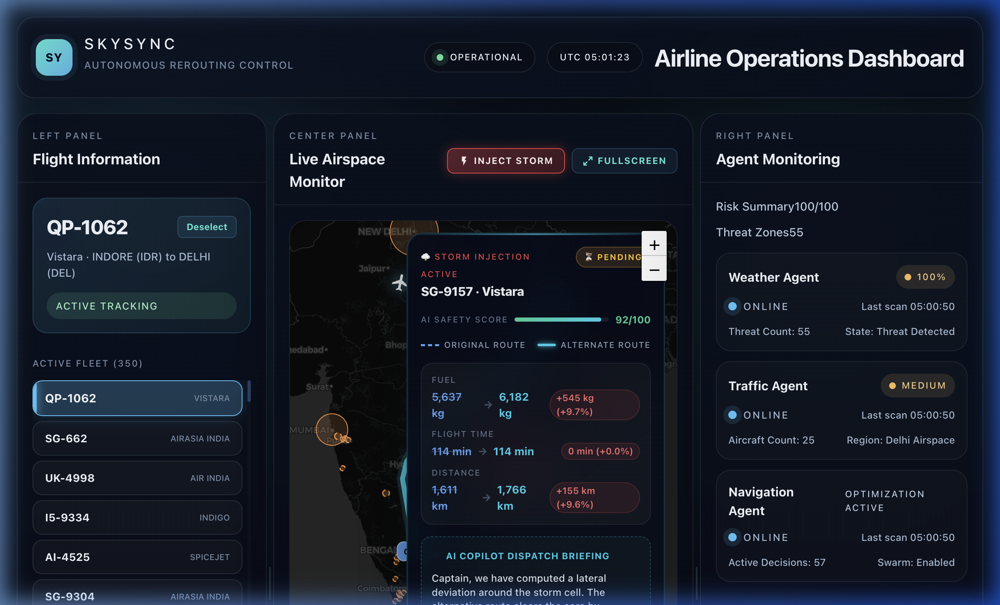
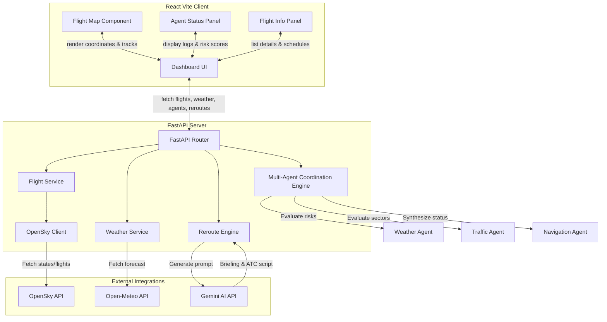

# ✈️ SkySync — Intelligent Flight Dispatch & Airspace Rerouting Monitor

SkySync is a next-generation, agent-driven flight monitoring and dynamic rerouting platform. By orchestrating a multi-agent system (Weather, Traffic, Navigation, and GenAI Dispatch Agents), SkySync simulates real-time radar networks, monitors airspace hazards, and generates live weather-avoidance detours. It features a responsive, glassmorphic dashboard interface integrated with an interactive map, and utilizes the Google Gemini API to deliver direct cockpit briefings and ATC scripts.

---

## 📸 Interface Screenshots

| 1. Active Airspace Monitor | 2. Flight Corridor & Telemetry |
| :---: | :---: |
|  |  |

| 3. Injected Storm Avoidance Reroute & AI Copilot Briefing |
| :---: |
|  |

---

## 🚀 Key Features

* **Interactive Live Airspace Map:**
  * Rendered via Leaflet.js with high-performance SVG plane markers.
  * Flight icons are dynamically rotated matching their heading coordinates.
  * Displays faint historical tracks and active routes.
  * Interactive tooltips show flight metrics (altitude, speed, airline, callsign).
* **Multi-Agent Coordination Engine:**
  * **Weather Agent:** Scans localized grid coordinates for meteorological hazards (wind speed, precipitation, convective indices) and computes risk alerts.
  * **Traffic Agent:** Aggregates radar returns in real-time, calculating spatial flight density around major airspace hubs (Delhi, Mumbai, Nagpur) to flag congestion.
  * **Navigation Agent:** Synthesizes inputs from weather and traffic to make decisions like hold pattern entries (`HOLD`), close observation warnings (`ADVISORY`), or rerouting triggers (`REROUTE_REQUIRED`).
* **Dynamic Weather Injection & Detours:**
  * Simulates severe convective storms anywhere on a flight's trajectory.
  * Automatically calculates lateral detours (bell-curve offset math) and cruise altitude modifications.
  * Estimates fuel efficiency deltas and flight time modifications (including saved hold times).
* **GenAI Copilot & Dispatch Scripting:**
  * Integrates with the **Google Gemini 1.5 Flash API** to generate natural language flight briefs for the captain.
  * Outputs exact radio transmission script formatting for standard ATC phraseology (avoiding manual drafting during high-stress flight situations).
* **High-Performance Saturation Mode:**
  * Cross-references live OpenSky API flight telemetry inside Indian Airspace.
  * Fills sparse airspace networks automatically with up to 350 simulated flight agents traversing real hub-to-hub corridors, creating a full saturation load.

---

## 🏗️ System Architecture

SkySync divides responsibilities between a React client, a FastAPI server, and upstream weather, satellite, and LLM APIs:



---

## 📂 Project Structure

```
skysync-main/
├── backend/
│   ├── agents/                   # Symbolic Multi-Agent definitions
│   │   ├── __init__.py
│   │   ├── navigation_agent.py
│   │   ├── traffic_agent.py
│   │   └── weather_agent.py
│   ├── routes/                   # FastAPI route endpoints
│   │   ├── agents.py
│   │   ├── flights.py
│   │   ├── health.py
│   │   ├── reroute.py            # Storm injection, rerouting, & GenAI briefings
│   │   └── weather.py
│   ├── services/                 # Internal business logic and API integrations
│   │   ├── flight_service.py     # Saturation logic and cache
│   │   ├── opensky_service.py    # OpenSky Network tracker client
│   │   └── weather_service.py    # Weather forecasts & summarized threat zones
│   ├── .env.example
│   ├── main.py                   # App startup and CORS middleware
│   └── req.txt                   # Backend requirements
├── frontend/
│   ├── src/
│   │   ├── assets/
│   │   ├── components/
│   │   │   ├── AgentPanel.jsx    # Real-time multi-agent activity log feed
│   │   │   ├── EventFeed.jsx     # Alert logs (INFO, WARNING, CRITICAL)
│   │   │   ├── FlightInfo.jsx    # Sidebar showing flight telemetry list
│   │   │   ├── FlightMap.jsx     # Fullscreen-capable Leaflet Map
│   │   │   ├── Header.jsx        # Top status bar with UTC clock
│   │   │   └── RerouteCard.jsx   # Interactive modal displaying detour metrics
│   │   ├── hooks/
│   │   │   └── useReroute.js
│   │   ├── pages/
│   │   │   └── dashboard.jsx     # Main layout container with resizable grid splitters
│   │   ├── services/
│   │   ├── utils/
│   │   ├── App.css
│   │   ├── index.css
│   │   └── main.jsx
│   ├── .env.example
│   ├── index.html
│   └── package.json              # Client dependencies and build setup
├── docs/
│   └── assets/                   # Screenshots and graphics
├── package.json                  # Root development script configurations
└── README.md                     # Documentation
```

---

## 🛠️ Configuration & Installation

### Prerequisites

* Node.js (v18+)
* Python (3.9+)

### 1. Clone & Install Dependencies
Run the install command from the root folder to set up packages for both the backend and frontend simultaneously:

```bash
npm run install:all
```

To install the backend python dependencies:
```bash
pip install -r backend/req.txt
```

### 2. Set Up Environment Variables

Create `.env` files based on the examples provided:

#### **Backend (`backend/.env`)**
```ini
OPEN_METEO_URL=https://api.open-meteo.com/v1/forecast
OPEN_METEO_TIMEOUT=20
GEMINI_API_KEY=your_gemini_api_key_here
```
> [!TIP]
> Setting `GEMINI_API_KEY` is optional but highly recommended. If left blank, SkySync will automatically fall back to its rule-based Symbolic AI text generator for the copilot briefing and ATC script.

#### **Frontend (`frontend/.env`)**
```ini
VITE_MAPBOX_TOKEN=your_mapbox_token_here
VITE_API_BASE_URL=http://localhost:8000
```

---

## ⚡ Launching the Application

Start the FastAPI backend and Vite frontend together in a single terminal terminal session:

```bash
npm run dev
```

* **Vite Web Dashboard:** [http://localhost:5173](http://localhost:5173)
* **FastAPI Docs:** [http://localhost:8000/docs](http://localhost:8000/docs)
* **FastAPI Health Check:** [http://localhost:8000/api/health](http://localhost:8000/api/health)

---

## 🛡️ License

Distributed under the MIT License. See [LICENSE](LICENSE) for details.
