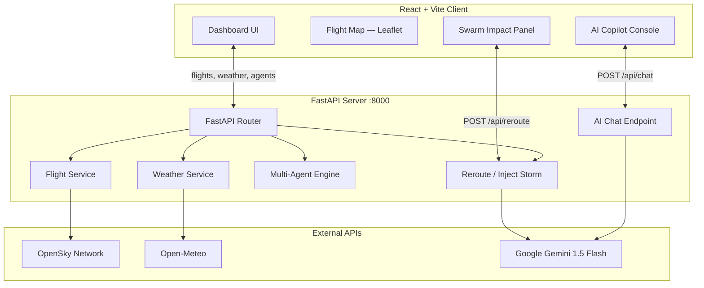

# ✈️ SkySync — Intelligent Airspace Intelligence Platform

SkySync is a next-generation, agent-driven flight monitoring and dynamic rerouting platform for Indian airspace. It orchestrates a **multi-agent AI system** (Weather, Traffic, Navigation, and GenAI Dispatch Agents), monitors live airspace hazards, generates real-time weather-avoidance detours, and features an **AI Copilot chatbot powered by Google Gemini** that can answer anything about flights, weather, fuel, and aviation procedures.

> 🚀 **Live repo:** [github.com/Unknown-infinity/SKYSYNC](https://github.com/Unknown-infinity/SKYSYNC)

---

## 📸 Interface Screenshots

| 1. Active Airspace Monitor | 2. Flight Corridor & Telemetry |
| :---: | :---: |
|  |  |

| 3. Inject Storm — Avoidance Reroute & AI Copilot Briefing |
| :---: |
|  |

---

## 🚀 Key Features

### 🗺️ Interactive Live Airspace Map
- Rendered via **Leaflet.js** with high-performance SVG plane markers
- Flight icons dynamically rotated to match real heading coordinates
- Displays active flight routes with animated polylines
- Interactive tooltips show altitude, speed, airline, and callsign
- **Draw Storm** mode: click anywhere on the map to place a custom storm cell
- **Fullscreen** mode for immersive airspace monitoring

### 🤖 Multi-Agent Coordination Engine
| Agent | Role |
|---|---|
| **Weather Agent** | Scans localized grid coordinates via Open-Meteo API for wind, precipitation, and convective hazards |
| **Traffic Agent** | Aggregates flight density around major Indian hubs (Delhi, Mumbai, Nagpur) and flags congestion |
| **Navigation Agent** | Synthesizes weather + traffic inputs to decide HOLD, ADVISORY, or REROUTE_REQUIRED actions |

### ⛈️ Inject Storm — Dynamic Weather Avoidance
- Simulate a **severe convective storm** anywhere along a flight's trajectory
- Automatically computes a **lateral bell-curve detour route** that bypasses the storm
- Storm holding/manoeuvre penalties **scale with wind speed** (15–35 min, 400–900 kg fuel)
- Shows a full **Agent Reasoning Log** with step-by-step decision trail
- Includes **AI Copilot briefing** and formatted **ATC radio script** via Gemini

### 🧠 AI Copilot Chatbot (Gemini-powered)
- Ask **anything** about flights, weather, rerouting, fuel, or aviation procedures in plain English
- Receives **live airspace context** (current flights + weather threats) with every message
- Powered by **Gemini 1.5 Flash** — falls back to rule-based answers if no API key is set
- Shows typing indicator while Gemini thinks; streams reply word-by-word
- Supports slash commands: `/reroute`, `/storm`, `/clear`

### ⚡ Swarm Mode — Fleet-Wide Storm Avoidance
- Select multiple flights and inject a storm across the **entire fleet simultaneously**
- Parallel rerouting calculations for all selected aircraft
- **Fleet Impact Summary** panel: total fuel Δ, total time Δ, average safety score
- Per-flight drill-down with Focus Mode to isolate a corridor on the map
- Approve or reject individual routes or all at once

### 📡 High-Performance Flight Data
- Live flight telemetry from the **OpenSky Network API** for Indian airspace
- Auto-fills sparse data with up to **350 simulated flight agents** on real hub-to-hub corridors
- Weather data from **Open-Meteo API** (free, no key required) — capped at 20 grid cells for fast response

---

## 🏗️ System Architecture



---

## 📂 Project Structure

```
SKYSYNC/
├── backend/
│   ├── agents/                     # Symbolic Multi-Agent definitions
│   │   ├── navigation_agent.py
│   │   ├── traffic_agent.py
│   │   └── weather_agent.py
│   ├── routes/                     # FastAPI route endpoints
│   │   ├── agents.py               # GET /api/agents
│   │   ├── chat.py                 # POST /api/chat  ← AI Copilot (Gemini)
│   │   ├── flights.py              # GET /api/flights
│   │   ├── health.py               # GET /api/health
│   │   ├── reroute.py              # POST /api/reroute (Inject Storm)
│   │   └── weather.py              # GET /api/weather
│   ├── services/
│   │   ├── flight_service.py       # OpenSky + saturation logic
│   │   ├── opensky_service.py      # OpenSky Network client
│   │   └── weather_service.py      # Open-Meteo weather threats
│   ├── .env.example                # Environment variable template
│   ├── main.py                     # App startup + CORS middleware
│   └── req.txt                     # Python dependencies
├── frontend/
│   └── src/
│       ├── components/
│       │   ├── AgentConsole.jsx    # AI Copilot chatbot + slash commands
│       │   ├── AgentPanel.jsx      # Agent status monitoring panel
│       │   ├── FlightMap.jsx       # Leaflet map with storm drawing
│       │   ├── RerouteCard.jsx     # Single-flight reroute result card
│       │   └── SwarmImpactPanel.jsx# Fleet-wide swarm reroute summary
│       ├── hooks/
│       │   └── useReroute.js       # Inject storm lifecycle hook
│       ├── pages/
│       │   └── dashboard.jsx       # Main layout + all panel wiring
│       ├── services/               # API client functions
│       ├── types/reroute.js        # JSDoc type definitions
│       └── utils/
│           ├── airportCoords.js    # Airport lat/lng lookup table
│           └── swarmFlights.js     # Swarm flight generation
├── docs/assets/                    # Screenshots
├── package.json                    # Root dev scripts (concurrently)
└── README.md
```

---

## 🛠️ Installation & Setup

### Prerequisites
- **Node.js** v18+
- **Python** 3.9+

### 1. Clone the repository
```bash
git clone https://github.com/Unknown-infinity/SKYSYNC.git
cd SKYSYNC
```

### 2. Install all dependencies
```bash
# Install frontend + root packages
npm install

# Install backend Python packages
pip install -r backend/req.txt
```

### 3. Set up environment variables

Copy the example file and fill in your values:
```bash
cp backend/.env.example backend/.env
```

**`backend/.env`**
```ini
OPEN_METEO_URL=https://api.open-meteo.com/v1/forecast
OPEN_METEO_TIMEOUT=5
GEMINI_API_KEY=your_gemini_api_key_here
```

> [!TIP]
> Get a free Gemini API key at [aistudio.google.com/app/apikey](https://aistudio.google.com/app/apikey).
> `GEMINI_API_KEY` is optional — SkySync falls back to rule-based responses if not set.
> Open-Meteo requires **no API key**.

---

## ⚡ Running the App

Start both backend and frontend together with a single command:

```bash
npm run dev
```

| Service | URL |
|---|---|
| 🌐 Vite Dashboard | [http://localhost:5173](http://localhost:5173) |
| ⚙️ FastAPI Docs (Swagger) | [http://localhost:8000/docs](http://localhost:8000/docs) |
| 💚 Health Check | [http://localhost:8000/api/health](http://localhost:8000/api/health) |

---

## 🔌 API Endpoints

| Method | Endpoint | Description |
|---|---|---|
| `GET` | `/api/health` | Server health check |
| `GET` | `/api/flights` | Live + simulated flights in Indian airspace |
| `GET` | `/api/weather` | Weather threats from Open-Meteo |
| `GET` | `/api/agents` | Weather, Traffic & Navigation agent status |
| `POST` | `/api/reroute` | Inject storm & compute alternate route |
| `POST` | `/api/chat` | AI Copilot — Gemini-powered free-text Q&A |

---

## 💬 Chatbot Commands

| Command | Action |
|---|---|
| `/reroute [flight]` | Reroute a specific flight (e.g. `/reroute AI-3088`) |
| `/storm [lat] [lng]` | Place a storm cell at coordinates (e.g. `/storm 21.5 76.8`) |
| `/storm clear` | Remove the custom storm cell |
| `/clear` | Clear the chat log |
| Free text | Ask the AI Copilot anything about flights or aviation |

---

## 🛡️ License

Distributed under the MIT License. See [LICENSE](LICENSE) for details.
